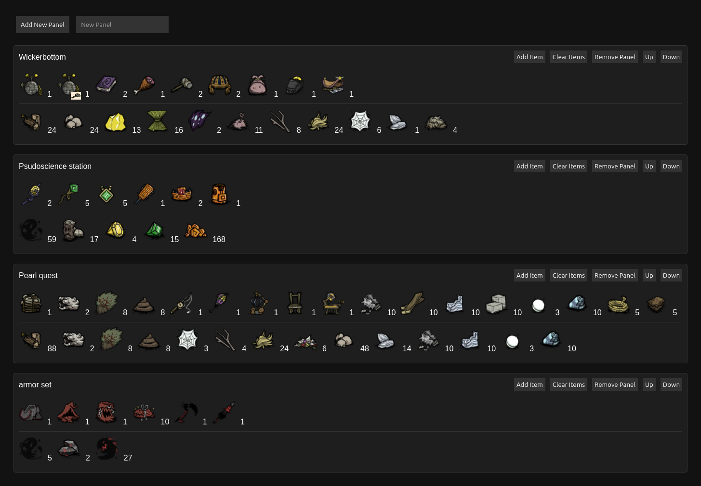

# DST Speedrun 🏃‍♂️🌲🔥

This project is a web-based tool for the game ["Don't Starve Together"](https://www.klei.com/games/dont-starve-together). It is specifically designed for speedrunners to bookmark or list items, raw materials, and structures needed for crafting. The tool also calculates the number of materials required for crafting various items.

The website refreshes items once per week.

## Table of Contents
- [Features](#features)
- [Website](#website)
- [Contributing](#contributing)
- [Note](#note)
- [Disclaimer](#disclaimer)
- [License](#license)

## Features ✨
- Bookmark or list items, raw materials, and structures 📑
- Calculate the number of materials required for crafting 🛠️
- Weekly refresh of items 🔄

## Website 🌐
You can access the tool at [dstspeedrun.github.io](https://dstspeedrun.github.io).

## Contributing 🤝
Contributions are welcome! If you have any suggestions or improvements, please create an issue or submit a pull request.

## Note 📝
This tool may not list all the items and may break on new updates. To report any problems or issues, please create an issue on the [GitHub repository](https://github.com/dstspeedrun/dstspeedrun.github.io/issues).

## Disclaimer ⚠️
This tool uses data fetched from [dontstarve.wiki.gg](https://dontstarve.wiki.gg).

## License 📄
This project is licensed under the MIT License - see the [LICENSE](LICENSE) file for details.
